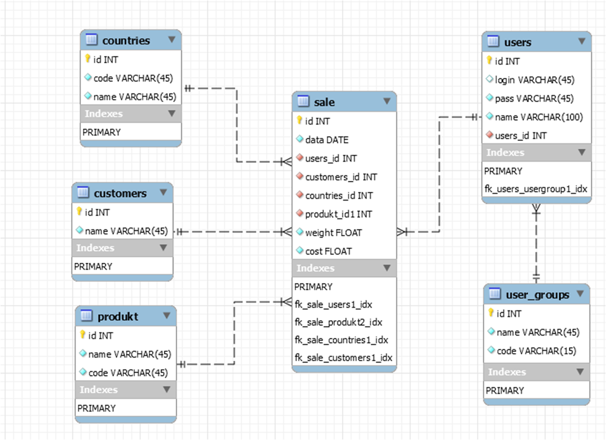
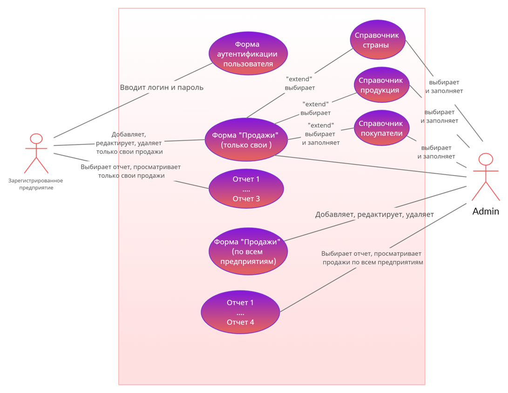

Данный сайт представляет собой сервис учета и анализа продаж.
Для учета продаж на сайте заполняются: форма учета продаж, cправочники по покупателям, видам продукции и странам.
Данные сохраняются в базе данных.
На основании информации базы данных можно сформировать отчеты о продажах за определенный
период, а также по другим выбранным параметрам.
Сервис предназначен для внутреннего использования. Для получения доступа к сервису
необходимо получить у администратора логин и пароль для входа.

Login: adminA

Password: admina123

ER DIAGRAM

USE CASE DIAGRAM

Ссылки на библиотеки:
https://packagist.org/packages/w1020/html
https://packagist.org/packages/w1020/orm
https://packagist.org/packages/phpoffice/phpspreadsheet